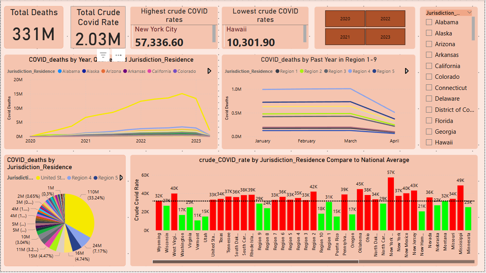

# 🦠 COVID-19 Pandemic Mortality Analysis

A data-driven analysis of COVID-19 mortality trends across countries using SQL and Power BI. This project focuses on understanding how the pandemic affected global populations, revealing patterns in deaths by time, geography, and demographics.

---

## 📌 Overview

This project analyzes publicly available COVID-19 mortality datasets to extract actionable insights. The goal is to uncover how deaths varied across different countries, age groups, and timelines—using clean, structured SQL queries and visual storytelling through Power BI dashboards.

---

## 🛠 Tools & Technologies

- **SQL Server** – Data transformation and analysis
- **Power BI** – Dashboard creation and visualization
- **Excel** – Initial inspection and preprocessing

---

## 🧠 Key SQL Analysis Highlights

- Cleaned and standardized raw data for consistent country naming and missing values.
- Aggregated deaths:
  - By **country and continent**
  - Over **monthly and yearly** periods
  - By **age group or demographic category** (if available)
- Used `GROUP BY`, `CASE WHEN`, and `JOIN` logic to compare countries and build a solid base for visual reporting.

---

## 📊 Power BI Dashboard Features

- Total global and country-wise COVID-19 deaths
- Monthly trend lines of deaths and recoveries
- Mortality rate per million population
- Filters by country and date
- Highlighted insights by continent

📸 **Dashboard Preview:**

---

## 📈 Key Insights

- 🌍 Countries with older populations like Italy and Japan had higher mortality rates.
- 📈 Deaths peaked in waves corresponding to major infection surges.
- 🗺️ Mortality trends varied significantly by continent—Europe and the Americas were heavily impacted.
- 📉 Some countries managed to flatten death curves earlier through faster responses.

---

## 📁 Repository Contents

---

## 🔗 Useful Links

- 💻 [View Project on GitHub](https://github.com/Muhammed-Shabnas-PA/COVID-19-Pandemic-Mortality-Analysis)
- 🌐 [View My Portfolio](muhammed-shabnas-pa.github.io/Portfolio-Website)

---

## 📬 Contact

**Muhammed Shabnas P A**  
📧 muhammedshabnaspa@gmail.com
🔗 GitHub: [@Muhammed-Shabnas-PA](https://github.com/Muhammed-Shabnas-PA)

---
